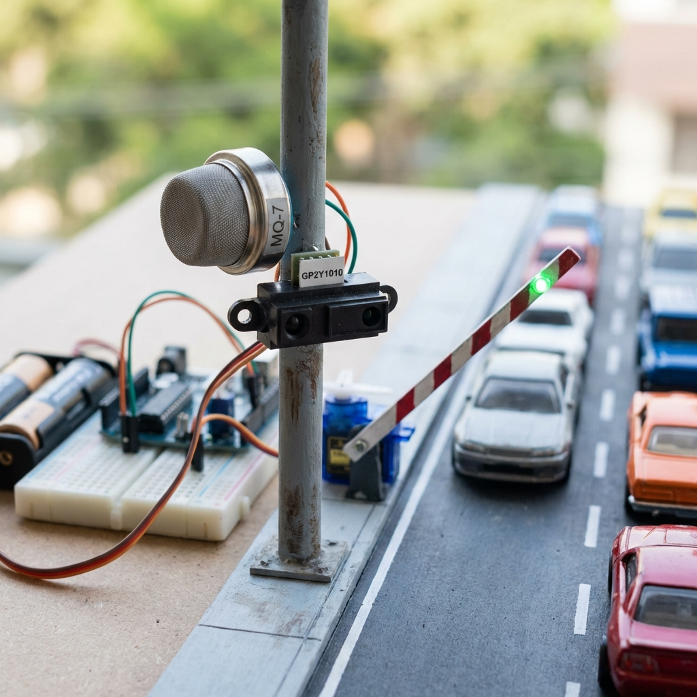
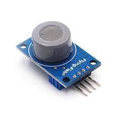
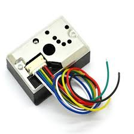
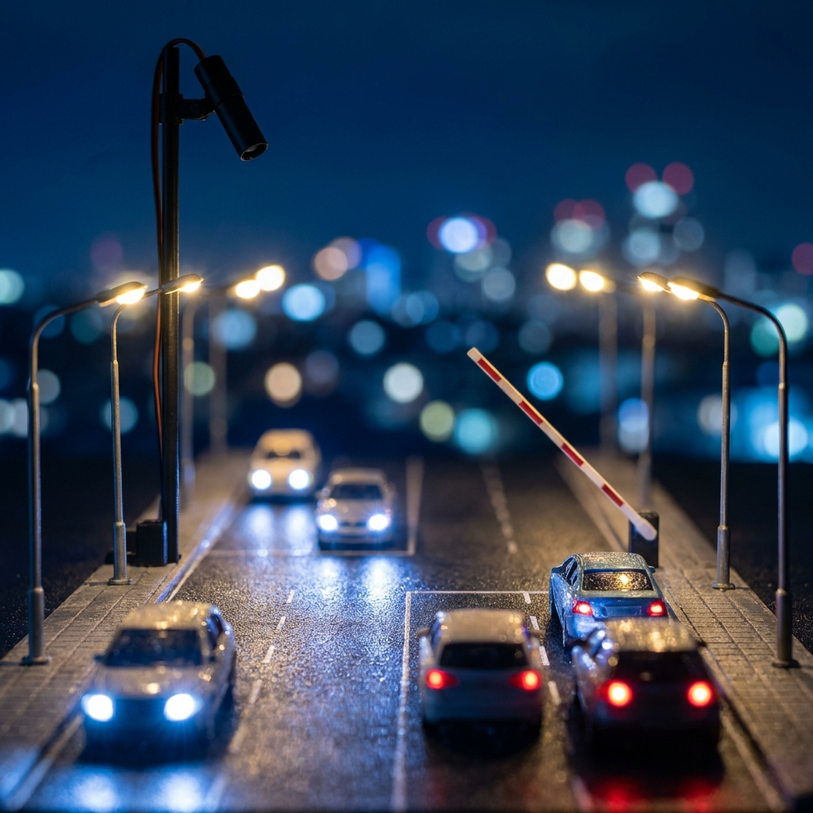
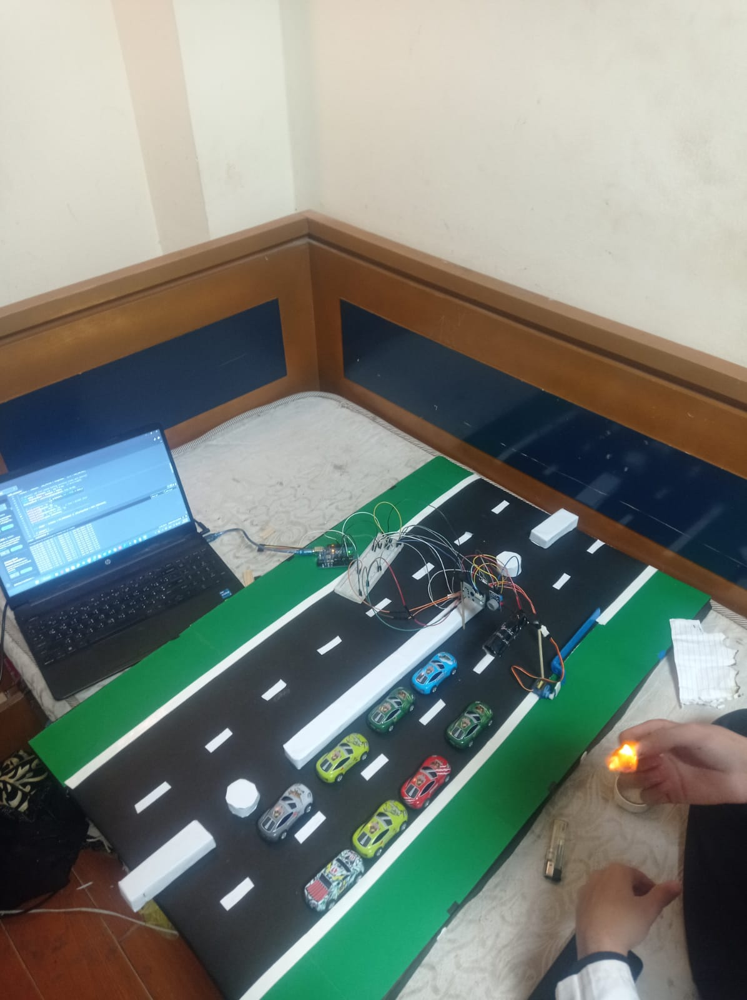

# Traffic Relief - Prototype Design Documentation

## Project Overview
**Traffic Relief** is an automated congestion management prototype designed specifically for the **6th October Bridge** in Egypt. The system utilizes an autonomous monitoring unit that analyzes real-time environmental data to detect traffic jams and proactively manage flow by opening auxiliary "green roads."

## 1. Physical Model Components

### A. Bridge Structure & Concept
The prototype models a section of the 6th October Bridge.
- **Objective:** relieve congestion by dynamically allocating road space.
- **Mechanism:** The structure features a primary lane and a secondary "green road" (relief lane).
- **Actuation point:** A barrier or signal system controls access to the relief lane based on sensor feedback.

### B. Sensor System
To ensure 24/7 reliability, the prototype employs a dual-logic system that adapts to lighting conditions.

#### ☀️ Daytime Operation (Environmental Sensing)

Visual detection is unreliable due to glare and shadows. The system monitors exhaust emissions instead.
- **Sensors Used:**
  - **MQ-7 Gas Sensor:** Detects Carbon Monoxide (CO) levels from vehicle exhaust.
    
  - **GP2Y1010 Optical Dust Sensor:** Detects Fine Particles (PM2.5) to confirm exhaust presence and rule out industrial pollution.
    
- **Detection Logic:**
  - **Condition:** Both CO and Dust readings must be "High" simultaneously to confirm congestion.
  - **Placement:** Mounted **2.5 meters** above ground to effectively capture exhaust clouds which remain low.

#### 🌙 Nighttime Operation (Light Intensity Analysis)

At night, the system analyzes the light patterns generated by vehicle headlights.
- **Sensor Used:**
  - **BH1750 Light Sensor:** Measures ambient light intensity.
    
- **Detection Logic:**
  - **Pattern Recognition:**
    - *Stationary Traffic:* Generates a steady, high-intensity light field.
    - *Moving Traffic:* Creates fluctuating signals.
  - **Trigger:** System activates when high, stable light intensity is detected.
- **Isolation Setup:**
  - Sensor is housed inside a **10 cm black tube** to narrow the field of view (FOV) and block interference from streetlights or surrounding buildings.
  - **Placement:** Mounted **5 meters** above the road.
  - **Angle:** Tilted downwards at **45 degrees** for an optimal bird's-eye view of the lanes.

### C. Actuation System (Control Mechanism)
The "brain" of the prototype is an **Arduino Controller**.
- **Process:**
  1. **Input:** Reads data from Day (Chemical) or Night (Light) sensors based on a photo-resistor trigger that detects ambient brightness.
  2. **Processing:** fusion algorithms validate congestion thresholds (e.g., >5 mins of high readings).
  3. **Actuation:** Activates a **Servo Motor**.
  4. **Output:** The servo lifts a barrier or switches a traffic signal, opening the secondary "green road" to relieve the jam.
  5. **Reset:** Once sensors indicate normalized flow, the road is closed.

---

## 2. Visual Aesthetic & Mood
The accompanying digital interface and promotional materials follow a premium, modern design language.

- **Theme:** "Smart City" / Futuristic Tech.
- **Color Palette:**
  - **Primary:** `#4a90e2` (Tech Blue) - representing trust and clarity.
  - **Secondary:** `#50e3c2` (Mint Green) - representing flow and the "green road" solution.
  - **Accent:** `#ff6b6b` (Alert Red) - for critical status or warnings.
  - **Background:** Light, airy gradients (`#f5f7fa` to `#c3cfe2`) for a clean look.
- **Typography:** **Outfit** (Google Fonts) – a geometric sans-serif that balances modernism with readability.
- **Styling Effects:**
  - **Glassmorphism:** Use of `backdrop-filter: blur(10px)` and semi-transparent white backgrounds (`rgba(255, 255, 255, 0.9)`) to create depth.
  - **Soft Shadows:** `0 4px 6px rgba(0, 0, 0, 0.05)` for a floating, lightweight feel.
  - **Clean Imagery:** Multiply blend modes on sensor images to integrate them seamlessly into cards.

---

## 3. Future Recommendations
To scale this prototype into a real-world Intelligent Traffic Management System (ITMS):

- **Thermal Sensing:** Integration of **FLIR Lepton thermal cameras** to detect vehicles in extreme weather (fog, sandstorms) where optical sensors fail.
- **Mesh Network:** Expanding the sensor network to cover multiple critical points along the 20.5 km bridge.
- **RDS Communication:** Using FM Radio Data System (RDS) and Traffic Message Channel (TMC) to broadcast real-time traffic updates directly to car navigation systems.

---

## 4. Team
- **Marwan El-Bohi:** Team Leader
- **Moaz Mohamed:** Developer
- **Yusuf Musa:** Designer

## 5. Prototype Gallery
Visual documentation of the physical build and testing.

| | |
|:---:|:---:|
|  | .jpeg) |
| .jpeg) | .jpeg) |
| .jpeg) | .jpeg) |

